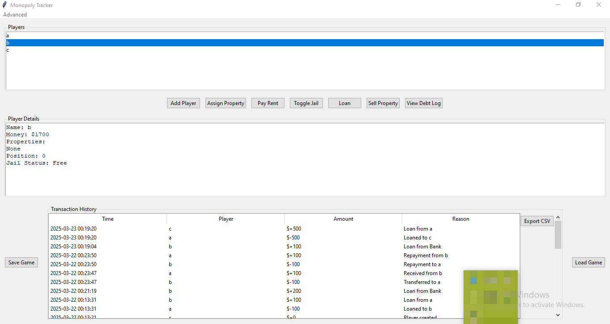

# Monopoly Tracker


GUI application for tracking Monopoly game state and player statistics
## Features
✅ Player management  
✅ Money tracking  
✅ Property ownership  
⏳ Save/Load system  
⏳ Jail status tracking  
✅ Loaning and repaying functionality  
✅ Property selling functionality  
✅ Exporting transactions history to CSV  

## Installation
```bash
git clone https://github.com/your-username/monopoly-tracker.git
cd monopoly-tracker
python main.py
```

## Keyboard Shortcuts
| Key Combination | Action               |
|-----------------|----------------------|
| Ctrl+N          | New Player           |
| Ctrl+S          | Quick Save           |
| Ctrl+L          | Load Game            |


## Screenshots



## Documentation
- [Roadmap](docs/ROADMAP.md)
- [Changelog](docs/CHANGELOG.md)

## License
MIT License - See [LICENSE](LICENSE)